# Establishing a Datastream from Cloud SQL (MySQL) to BigQuery Through Cloud Auth Proxy

**Work in progress.**

Welcome back to our series on datastream workflows! In our [previous article](https://ahmedzbyr.gitlab.io/gcp/datastream_mysql-bq/), we explored the basics of setting up a datastream workflow. Today, we're diving deeper by implementing a datastream from MySQL to BigQuery, utilizing the CloudSQL Proxy. This approach is particularly relevant in scenarios where CloudSQL is confined to a private network, making direct connections via external IP unfeasible. We'll guide you through the process of establishing a secure connection to CloudSQL using a proxy node equipped with the CloudSQL Auth Proxy binary, mirroring a common setup in many organizations where direct access to CloudSQL is restricted.

You can find complete terraform on [GitHub](https://github.com/ahmedzbyr/taealam/tree/master/terraform_examples/datastream_mysql_to_bq_thru_proxy).


`Source Image: Google`


Below are the steps we will use to setup the Infra for our Datastream CDC Workflow.

- [Establishing a Datastream from Cloud SQL (MySQL) to BigQuery Through Cloud Auth Proxy](#establishing-a-datastream-from-cloud-sql-mysql-to-bigquery-through-cloud-auth-proxy)
  - [Step 1: Create a BigQuery Dataset for our Destination](#step-1-create-a-bigquery-dataset-for-our-destination)
  - [Step 2: Create a Private network for the CloudSQL and GCE instance](#step-2-create-a-private-network-for-the-cloudsql-and-gce-instance)
  - [Step 3: Setup the firewall rules required for the network to communicate](#step-3-setup-the-firewall-rules-required-for-the-network-to-communicate)
  - [Step 4: Establishing the CloudSQL (MySQL) Instance on a Private Network](#step-4-establishing-the-cloudsql-mysql-instance-on-a-private-network)
  - [Step 5: Create the GCE instance on private network (subnetwork).](#step-5-create-the-gce-instance-on-private-network-subnetwork)
  - [Step 6: Create Private connection to GCE proxy node.](#step-6-create-private-connection-to-gce-proxy-node)
  - [Step 7: Create Connection Profile to the Source MySQL using Private connection.](#step-7-create-connection-profile-to-the-source-mysql-using-private-connection)
  - [Step 8: Create Connection Profile to the Destination BigQuery.](#step-8-create-connection-profile-to-the-destination-bigquery)
  - [Step 9: Create a Datastream stream to connection the source and destination](#step-9-create-a-datastream-stream-to-connection-the-source-and-destination)
  - [Step 10: (TESTING) Populating Data in CloudMySQL](#step-10-testing-populating-data-in-cloudmysql)
  - [Step 11: (TESTING) Checking Data in Destination BigQuery](#step-11-testing-checking-data-in-destination-bigquery)

## Step 1: Create a BigQuery Dataset for our Destination

Next, we'll focus on establishing a destination dataset for our data. For our setup, we're selecting the `single_target_dataset` option, which allows us to consolidate all our data into this single dataset.

Important: Keep in mind that when you opt for the `single_target_dataset` configuration, the tables inside this dataset will adopt a naming format that combines the database name with the table name, structured as `databaseName_tableName`.

```hcl
# Resource definition for creating a Google BigQuery dataset
resource "google_bigquery_dataset" "dataset" {
  project       = var.project                  # The Google Cloud project ID
  dataset_id    = "datastream_example_dataset" # Unique ID for the BigQuery dataset
  friendly_name = "datastream_example_dataset" # A user-friendly name for the dataset
  description   = "This is a test description" # Description of the dataset's purpose or contents
  location      = "us-east1"                   # The geographic location where the dataset should reside

  # Default expiration time for tables within this dataset (milliseconds)
  default_table_expiration_ms = 3600000 # 1 hour (3600000 milliseconds)

  # Labels for the dataset, useful for categorization or organization within GCP
  labels = {
    type = "datastream" # Example label indicating the dataset's intended for datastream
  }

  # If set to true, this ensures that all contents within the dataset will be deleted upon the dataset's destruction
  delete_contents_on_destroy = true # Use with caution to prevent accidental data loss here this is true for TESTING ONLY
}
```

## Step 2: Create a Private network for the CloudSQL and GCE instance

1. **VPC Network**: Our next step involves setting up a VPC network, which we will name `private-interconnect`. We'll opt out of the automatic `subnetwork` creation, as our plan is to manually establish a subnet. This subnet will be specifically located in the `us-east1` region, aligning with our targeted regional requirements.

```hcl
# Resource for creating a Google Compute VPC network
resource "google_compute_network" "main" {
  project = var.project            # Project this resource belongs in
  name    = "private-interconnect" # Name of the VPC network

  # Disables automatic subnetwork creation we will create it for specific region below
  auto_create_subnetworks = "false"
}
```

2. **Global Private IP Address**: Allocates a global private IP address with the purpose set for VPC peering and this what we will be using the to setup the CloudSQL (MySQL) instance, This can only be accessed from the Cloud Auth Proxy Node which will be created in the subsequent steps.

```hcl
# Resource for allocating a global private IP address for VPC peering
# Internal IP address ranges that are allocated for services private connection
resource "google_compute_global_address" "private_ip_address" {
  project       = var.project                       # Project this resource belongs in
  name          = "private-interconnect-ip-address" # Name for the global address resource
  purpose       = "VPC_PEERING"                     # Specifies the purpose as VPC Peering
  address_type  = "INTERNAL"                        # Type of address (Internal for VPC peering)
  prefix_length = 24                                # Prefix length of the IP range
  network       = google_compute_network.main.id    # Associates with the created VPC network
}
```

3. **Service Networking Connection**: Establishes a service networking connection with the reserved peering ranges for the purpose of VPC peering, this what we will be using to setup a peering from `"servicenetworking.googleapis.com"` so that we can communicate to the instance on this network.

```hcl
# Resource to establish a service networking connection for VPC peering
resource "google_service_networking_connection" "main" {
  network                 = google_compute_network.main.id                          # VPC network to which the service connection is made
  service                 = "servicenetworking.googleapis.com"                      # Service to be connected (Service Networking API)
  reserved_peering_ranges = [google_compute_global_address.private_ip_address.name] # Uses the reserved global address
}
```

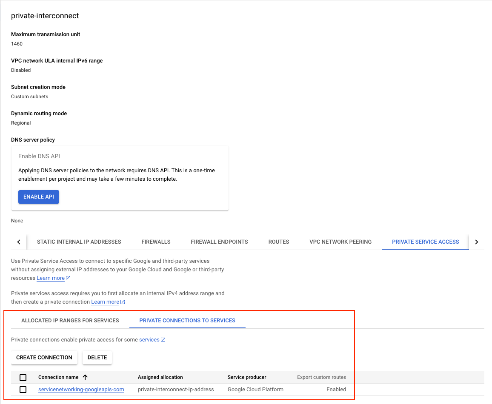

4. **Network Peering Routes Configuration**: Google Cloud VPC Network Peering is a powerful feature that links two Virtual Private Cloud (VPC) networks, allowing resources within each network to interact seamlessly. In our setup, we're utilizing this capability to facilitate communication between the GCE instance and the Cloud SQL instance. Additionally, this setup enables:
   - Communication across all subnets using internal IPv4 addresses.
   - For dual-stack subnets, the ability to communicate via both internal and external IPv6 addresses.

```hcl
# Resource for configuring network peering routes
resource "google_compute_network_peering_routes_config" "peering_routes" {
  project              = var.project                                       # Project this resource belongs in
  peering              = google_service_networking_connection.main.peering # Refers to the peering created in the service networking connection
  network              = google_compute_network.main.name                  # Network in which the routes are configured
  import_custom_routes = true                                              # Allows importing custom routes into the network peering
  export_custom_routes = true                                              # Allows exporting custom routes from the network peering
}
```

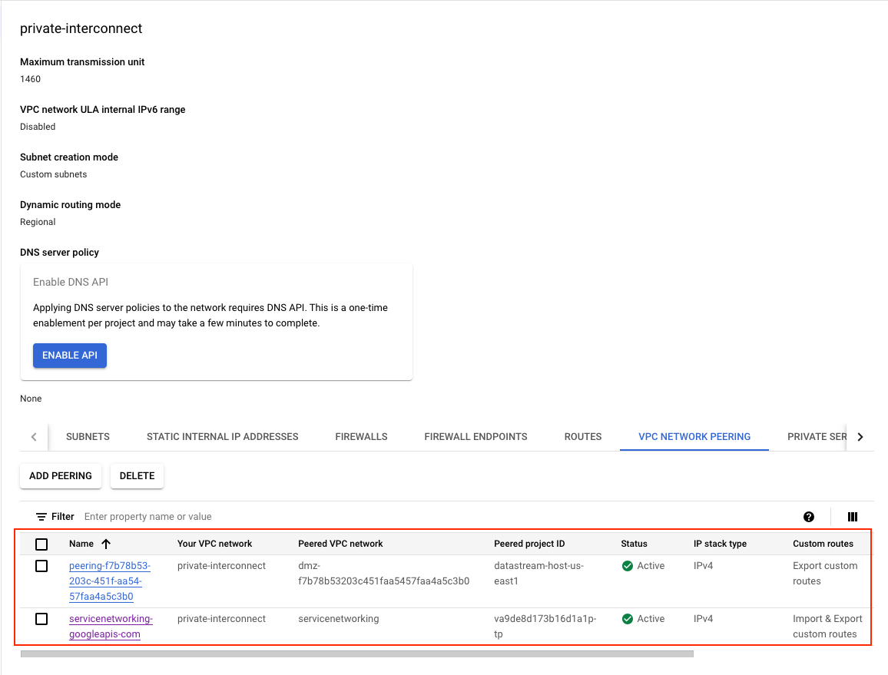

5. **Subnetwork for Proxy Node**: Creates a subnetwork named `private-interconnect-subnetwork` with a specified IP range, intended for private access and this is the network used for the GCE instance to setup the Cloud SQL Auth Proxy.

```hcl
# Resource definition for a Google Compute Engine subnetwork we will be using this subnet to setup our proxy node.
resource "google_compute_subnetwork" "subnetwork_purpose_private_nat" {
  provider      = google-beta                       # Using beta as the purpose PRIVATE is still in beta.
  project       = var.project                       # Specifies the project ID where the subnetwork will be created
  name          = "private-interconnect-subnetwork" # Sets the name of the subnetwork
  region        = var.region                        # Defines the region where the subnetwork will reside
  ip_cidr_range = "192.168.1.0/24"                  # Determines the IP address range for the subnetwork in CIDR format

  # Sets the purpose of the subnetwork to 'PRIVATE_RFC_1918' which means the subnetwork
  # is intended for use with private Google Access and instances without external IP addresses
  purpose = "PRIVATE"

  # When enabled, VMs in this subnetwork without external IP addresses can access Google APIs and services by using Private Google Access.
  private_ip_google_access = true

  # Links this subnetwork to the specified network resource's ID
  network = google_compute_network.main.id
}
```

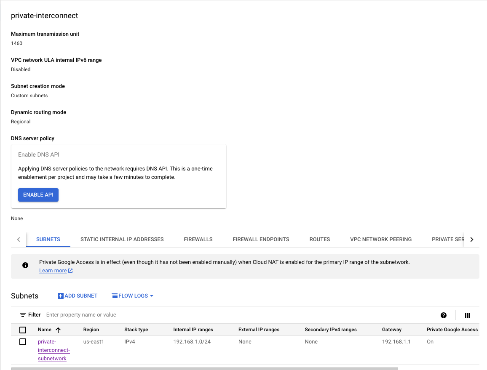

## Step 3: Setup the firewall rules required for the network to communicate

1. **Firewall Rule** Database: Sets up a firewall rule named `datastream-inbound-connections` to allow inbound connections `"172.31.200.0/29"` on specified ports (`3306`, `5432`) for instances with specific tags.
   1. `172.31.200.0/29` is the datastream private connection CIDR range we will be setting up later on this post.
   2. We are opening ports for MySQL `3306`, PostgreSQL `5432`.  

```hcl
# Resource for creating a firewall rule for Google Compute Engine which will get requests from datastream private connection.
resource "google_compute_firewall" "main" {
  project = var.project                      # The project ID where the firewall rule will be created
  name    = "datastream-inbound-connections" # Name of the firewall rule
  network = google_compute_network.main.id   # The network to which the rule applies

  # A brief description of the firewall rule
  description = "Creates firewall rule targeting tagged instances"

  # Specifies the rule to allow incoming traffic
  allow {
    protocol = "tcp"              # The protocol for which the rule applies
    ports    = var.ports_to_allow # The port number (MySQL/PostgreSQL default port) to be allowed 
  }

  # The source IP ranges that will be allowed through the firewall
  source_ranges = [var.private_connection_cidr]

  # Targets the rule to instances tagged with these values
  target_tags = ["datastream", "cloud-sql-proxy"]
}
```

2. **Firewall Rule** ssh (Optional): We also have a inbound `ssh` connection to reach the GCE instance over `ssh`. [ **NOTE:** This is optional for testing as in a org environment we would not set a rules `0.0.0.0/0` like we have done here]

```hcl
# Resource for creating a firewall rule for Google Compute Engine which will get requests from datastream private connection.
resource "google_compute_firewall" "ssh" {
  project = var.project                          # The project ID where the firewall rule will be created
  name    = "datastream-inbound-connections-ssh" # Name of the firewall rule
  network = google_compute_network.main.id       # The network to which the rule applies

  # A brief description of the firewall rule
  description = "Creates firewall rule for ssh targeting tagged instances"

  # Specifies the rule to allow incoming traffic
  allow {
    protocol = "tcp"  # The protocol for which the rule applies
    ports    = ["22"] # ssh to be allowed 
  }

  # The source IP ranges that will be allowed through the firewall
  # This is here for testing and needs to be a specific IP range. 
  source_ranges = ["0.0.0.0/0"]

  # Targets the rule to instances tagged with these values
  target_tags = ["datastream", "cloud-sql-proxy"]
}
```

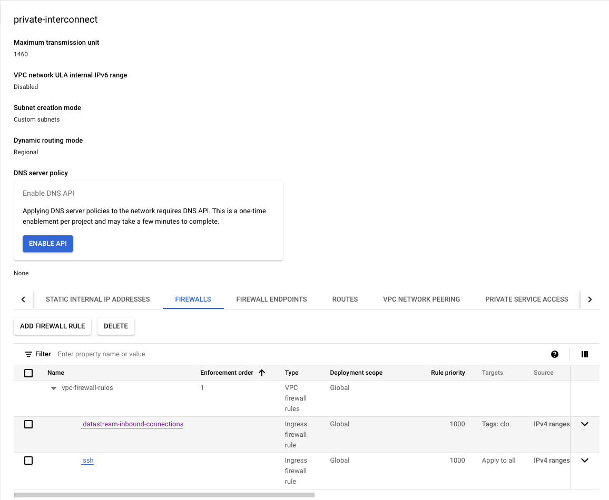

3. **Setting Up Routing** (Optional): Optional Configuration for Updates: This setup is optional and primarily necessary if the GCE instance requires internet access for updates or software installations.

```hcl
# Resource definition for a Google Compute Engine router
resource "google_compute_router" "router" {
  project = var.project         # The project ID where the router will be created
  name    = "datastream-router" # The name of the router

  # The region where the router will be created, taken from the previously defined subnetwork
  region  = google_compute_subnetwork.subnetwork_purpose_private_nat.region
  network = google_compute_network.main.id # The network ID to which the router belongs

  # BGP configuration block for the router
  bgp {
    asn = 64514 # The Autonomous System Number (ASN) for BGP to use. 
    # This should be a private ASN (64512 - 65534 for 16-bit ASNs)
  }
}
```

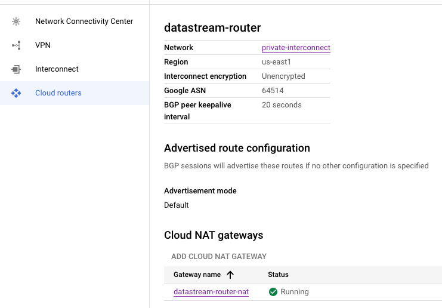

```hcl
# Resource definition for a NAT service on the Google Compute Engine router
resource "google_compute_router_nat" "nat" {
  project = var.project                         # The project ID where the NAT will be created
  name    = "datastream-router-nat"             # The name of the NAT service
  router  = google_compute_router.router.name   # The router name where the NAT will reside
  region  = google_compute_router.router.region # The region of the router

  # NAT IP allocation option set to automatically allocate NAT IPs
  nat_ip_allocate_option = "AUTO_ONLY"

  # Source subnetwork IP ranges to include in NAT. 
  # 'ALL_SUBNETWORKS_ALL_IP_RANGES' indicates that all primary and secondary ranges in all subnetworks in the region are allowed
  # For better router configuration we can setup access to specific subnets as well. 
  source_subnetwork_ip_ranges_to_nat = "ALL_SUBNETWORKS_ALL_IP_RANGES"

  # Logging configuration block
  log_config {
    enable = true          # If logging should be enabled for the NAT
    filter = "ERRORS_ONLY" # Log level filter, which here is set to log only errors
  }
}
```

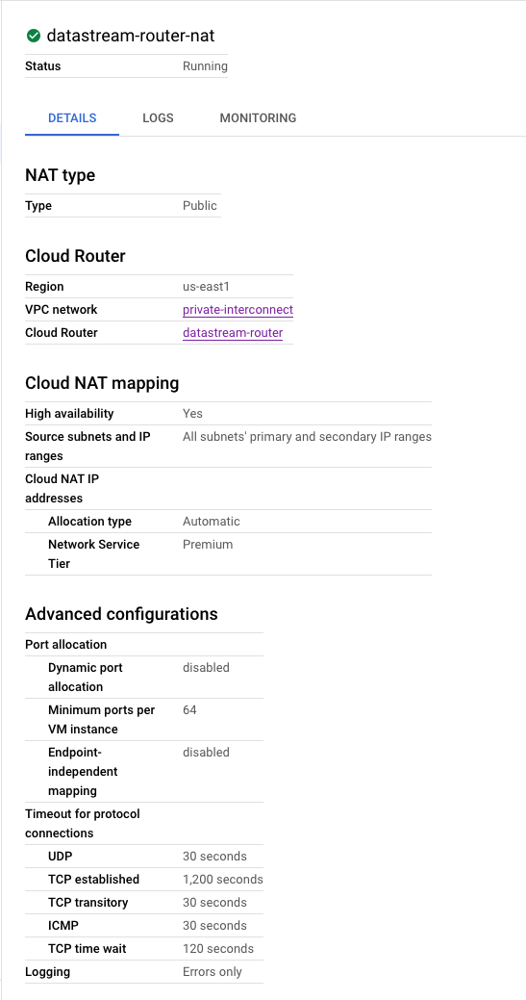

## Step 4: Establishing the CloudSQL (MySQL) Instance on a Private Network

1. **Create MySQL Instance**: With our network now fully prepared, it's time to set up our working environment. The first task at hand is to create the CloudSQL instance, which we will configure to operate on the private global network.

```hcl
# Resource to create a Cloud SQL database instance
resource "google_sql_database_instance" "main" {
  name             = "cloudsql-mysql-instance"   # Name of the SQL database instance
  database_version = "MYSQL_8_0"                 # Version of MySQL to use
  root_password    = random_string.random.result # Root password, randomly generated
  region           = var.region                  # Region for the database instance
  project          = var.project                 # Project ID

  settings {
    tier = "db-f1-micro" # The machine type (tier) for the database

    # Configuration for IP connectivity
    ip_configuration {
      ipv4_enabled                                  = false
      private_network                               = google_compute_network.main.id
      enable_private_path_for_google_cloud_services = true
    }


    # Configuration for backups
    backup_configuration {
      enabled                        = true    # Enables backups
      binary_log_enabled             = true    # Enables binary logging for point-in-time recovery
      start_time                     = "20:55" # Start time for backup window
      transaction_log_retention_days = "7"     # Number of days to retain transaction logs
    }
  }
  deletion_protection = "false" # Disables deletion protection, use with caution
  depends_on          = [google_service_networking_connection.main]
}
```

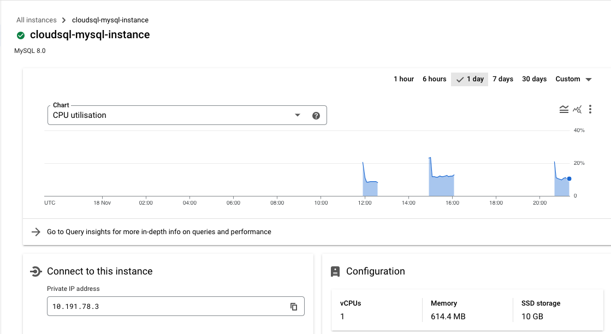

2. **Create User**: After the instance is operational, our next step is to create a user account on it. This user will play a crucial role in facilitating communication with the database for the purpose of data migration via datastream.

```hcl
# Resource to create a SQL user
resource "google_sql_user" "users" {
  project  = var.project                            # Project ID
  name     = var.user                               # Name of the SQL user
  instance = google_sql_database_instance.main.name # Associate user with the SQL instance
  host     = "%"                                    # Allow connection from any host
  password = random_string.random.result            # Password for the SQL user, randomly generated
}
```


3. **Create Database**: Next, we'll create a database that will serve as the initial repository for our data. This database will hold the data to be replicated to the destination.

```hcl
# Resource to create a SQL database within the instance
resource "google_sql_database" "datastream_src_database" {
  project         = var.project                            # Project ID
  name            = "datastream-src-database"              # Name of the database
  instance        = google_sql_database_instance.main.name # Database instance name
  deletion_policy = "ABANDON"                              # Deletion policy for the database
}
```


## Step 5: Create the GCE instance on private network (subnetwork).

We're now ready to configure the GCE instance within the private network we established in the subnet. This setup will include the CloudSql Auth Proxy on the node, enabling it to handle requests directed to the database.

1. **Setup Service Account**: To begin, we must create a service account. This account will be assigned the `roles/cloudsql.editor` role, so that it has necessary permissions to interact with the CloudSQL server.

```hcl
# Resource for creating a Google service account
resource "google_service_account" "main" {
  project      = var.project                                                       # Project ID where the service account will be created
  account_id   = "datastream-sa"                                                   # Unique ID for the service account
  display_name = "Custom service account for datastream for Cloud SQL Proxy node." # Display name for the service account
}

# Resource for assigning an IAM role to a service account in a Google Cloud project
resource "google_project_iam_member" "main" {
  project = var.project # The project ID where the IAM role should be assigned

  # The IAM role to be assigned to the service account
  # This is required to grants permissions for managing Cloud SQL resources, 
  # by running the cloud auth proxy command. Else we get an NOT AUTHORIZED error from CloudSQL.
  role = "roles/cloudsql.editor"

  # The member to whom the role is assigned
  # In this case, it's the email of the previously created service account
  member = "serviceAccount:${google_service_account.main.email}"
}
```

2. **Create GCE Instance**: Moving forward, the next step involves configuring the node and initiating the CloudSQL proxy binary. Make sure to use the `--private-ip` option, as this is essential for integrating with the CloudSQL instance that has been established on a private network.

```hcl
# Data source to retrieve available compute zones in a specified region
data "google_compute_zones" "get_avail_zones_from_region" {
  project = var.project # Project ID
  region  = var.region  # Region to fetch the compute zones from
}

# Resource for creating a Google Compute Engine instance
resource "google_compute_instance" "main" {
  project      = var.project                   # Project ID where the instance will be created
  name         = "datastream-cloud-auth-proxy" # Name of the compute instance
  machine_type = "n2-standard-2"               # Machine type for the instance

  # Selects the first available zone from the fetched compute zones
  zone = data.google_compute_zones.get_avail_zones_from_region.names[0]
  tags = ["datastream", "cloud-sql-proxy"] # Tags to identify and categorize the instance

  # Configuration for the boot disk of the instance
  boot_disk {
    initialize_params {
      image = "debian-cloud/debian-11" # Operating system image for the boot disk
      labels = {
        type = "datastream" # Label for categorizing the disk
      }
    }
  }

  # Network interface configuration, attaching the instance to the our subnetwork created earlier.
  network_interface {
    network    = google_compute_network.main.self_link
    subnetwork = google_compute_subnetwork.subnetwork_purpose_private_nat.self_link
  }

  # Metadata to describe the instance's purpose and use
  metadata = {
    purpose = "datastream"
    use     = "cloud-sql-proxy"
  }

  # Startup script to install and run Cloud SQL Proxy
  # https://cloud.google.com/sql/docs/mysql/connect-auth-proxy#start-proxy
  # https://stackoverflow.com/a/62478143 <- Need to make use of this here, so that it is moved to systemd
  metadata_startup_script = <<-EOF
    echo -e "Downloading cloud-sql-proxy script...";
    echo -e "----------------------------------";
    curl -o cloud-sql-proxy https://storage.googleapis.com/cloud-sql-connectors/cloud-sql-proxy/${var.cloud_sql_proxy_version}/cloud-sql-proxy.linux.amd64; 
    echo -e "Update permissions on the script.";
    chmod +x cloud-sql-proxy; 
    echo -e "Running the script to connection \"${google_sql_database_instance.main.connection_name}\" node";
    ./cloud-sql-proxy --address 0.0.0.0  --port 3306 --private-ip ${google_sql_database_instance.main.connection_name} 
    EOF 

  # Service account configuration for the instance
  service_account {
    email  = google_service_account.main.email # Email of the created service account
    scopes = ["cloud-platform"]                # Scope specifying the instance should have access to all Cloud Platform services
  }
}
```

Here is the command which runs the proxy service, this should be eventually [moved to systemd](https://stackoverflow.com/a/62478143) as this will help `start`/`stop` the service as required.

```shell
./cloud-sql-proxy --address 0.0.0.0  --port 3306 --private-ip ${google_sql_database_instance.main.connection_name} 
```

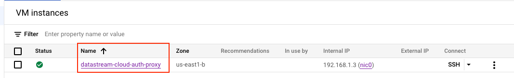

## Step 6: Create Private connection to GCE proxy node.

Private connectivity is the term used to describe a special, direct link that connects your Virtual Private Cloud (VPC) network with Datastream's own private network. This arrangement enables Datastream to seamlessly communicate with your resources via internal IP addresses. Choosing private connectivity means you're setting up a private, secure channel on the Datastream network, exclusively for your use, without sharing it with other customers.

`Source Image: Google`


In scenarios where you're using Cloud SQL for MySQL or Cloud SQL for PostgreSQL with private IP addresses, it involves setting up a VPC peering connection. This connection is between your VPC network and the VPC network of the underlying Google services where your Cloud SQL instance is hosted.

However, it's important to note that Datastream's network cannot directly peer with the private services network of Cloud SQL. Additionally, due to the non-transitive nature of VPC peering, a reverse proxy is necessary for Cloud SQL. This proxy serves as a crucial link, bridging the connection from Datastream to your specific Cloud SQL instance.

```hcl
module "create_private_connection_to_instance" {
  source                = "git::https://github.com/ahmedzbyr/taealam.git///tf_modules/datastream/datastream_private_connection"
  project               = var.project                           # Project where the connection profile will be created
  display_name          = "datastream-mysql-private-connection" # Display name for the connection profile
  location              = var.region                            # Location of the connection profile
  private_connection_id = "datastream-mysql-private-connection" # Unique identifier for the connection profile

  labels = {
    key = "datastream"
  }

  vpc_peering_config = {
    vpc    = google_compute_network.main.id # VPC network to peer with
    subnet = var.private_connection_cidr    # IP range for the subnet
  }
}
```

For an in-depth understanding of the configuration parameters, you can refer to the [datastream module](https://github.com/ahmedzbyr/taealam/tree/master/tf_modules/datastream). Additionally, for further examples and practical applications, visit [GitHub repository](https://github.com/ahmedzbyr/taealam/tree/master/tf_modules/datastream/examples).

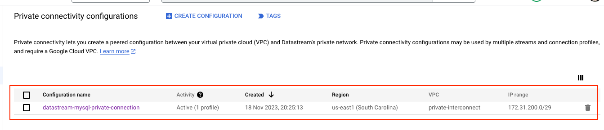

## Step 7: Create Connection Profile to the Source MySQL using Private connection.

After establishing private connectivity, we can leverage it to connect to the proxy node. By providing the IP address of this proxy node, we create a direct link to the CloudSQL instance.

```hcl
module "create_src_connection_profile_mysql" {
  source                = "git::https://github.com/ahmedzbyr/taealam.git//tf_modules/datastream/datastream_connection_profile"
  project               = var.project                              # Project where the connection profile will be created
  display_name          = "datastream-connection-csql-proxy-mysql" # Display name for the connection profile
  location              = var.region                               # Location of the connection profile
  connection_profile_id = "datastream-connection-csql-proxy-mysql" # Unique identifier for the connection profile

  labels = {
    key = "datastream"
  }

  mysql_profile = {
    hostname = google_compute_instance.main.network_interface.0.network_ip # (Required) Hostname for the MySQL connection.
    username = var.user                                                    # (Required) Username for the MySQL connection.
  }

  # Private connection to use.
  private_connectivity = module.create_private_connection_to_instance.this_private_connection_id

  #
  # IMPORTANT NOTE:
  #   This secret has to be from a VAULT and should not be in plain text as it is here 
  #   Adding it here for testing only. 
  #
  secret = {
    mysql_profile = {
      password = random_string.random.result
    }
  }
}
```

## Step 8: Create Connection Profile to the Destination BigQuery.

Setting up a connection profile for BigQuery is straightforward and requires no complex configuration. This step simplifies the process of connecting to a BigQuery dataset in the subsequent phase.

```hcl
module "create_dest_connection_profile_bq" {
  source                = "git::https://github.com/ahmedzbyr/taealam.git//tf_modules/datastream/datastream_connection_profile"
  project               = var.project                  # Project where the connection profile will be created
  display_name          = "datastream-conn-profile-bq" # Display name for the connection profile
  location              = var.region                   # Location of the connection profile
  connection_profile_id = "datastream-conn-profile-bq" # Unique identifier for the connection profile

  labels = {
    type = "datastream"
  }
  bigquery_profile = {}
}
```

## Step 9: Create a Datastream stream to connection the source and destination

With all components in place, we're now ready to finalize our datastream stream setup. By utilizing the previously established source and destination connection profiles, we'll connect these two sides. This action forms a workflow that seamlessly transfers data from the source database to the designated BigQuery dataset.

```hcl

module "datastream_mysql_to_bq_dataset" {
  source  = "git::https://github.com/ahmedzbyr/taealam.git//tf_modules/datastream/datastream_stream"
  project = var.project # Project where the connection profile will be created

  # Set a human-readable name for the Datastream stream
  display_name = "datastream-mysql-to-bq"

  # Unique identifier for the Datastream stream
  stream_id = "datastream-mysql-to-bq"

  # The location where the Datastream resource will be created
  location = "us-east1"

  # Labels are key/value pairs for tagging and organizing GCP resources
  labels = {
    type = "datastream"
  }

  # Backfill configuration to determine how historical data is handled
  backfill_all = {}

  # Desired state of the Datastream stream, e.g., "RUNNING" or "PAUSED"
  desired_state = "RUNNING"

  # Configuration for the source connection profile
  source_connection_profile = module.create_src_connection_profile_mysql.this_connection_profile_id # "projects/{project}/locations/{location}/connectionProfiles/{name}"
  mysql_source_config = {
    include_objects = {
      mysql_databases = [{
        database = google_sql_database.datastream_src_database.name
      }]
    }
  } # Placeholder for MySQL source-specific configuration

  # Configuration for the destination connection profile
  destination_connection_profile = module.create_dest_connection_profile_bq.this_connection_profile_id # "projects/{project}/locations/{location}/connectionProfiles/{name}"
  bigquery_destination_config = {
    # Configuration for BigQuery as the destination
    single_target_dataset = {
      # ID of the BigQuery dataset to which the Datastream will write data
      dataset_id = google_bigquery_dataset.dataset.id
    }
  }
}

```

For an in-depth understanding of the configuration parameters, you can refer to the [datastream module](https://github.com/ahmedzbyr/taealam/tree/master/tf_modules/datastream). Additionally, for further examples and practical applications, visit [GitHub repository](https://github.com/ahmedzbyr/taealam/tree/master/tf_modules/datastream/examples).

## Step 10: (TESTING) Populating Data in CloudMySQL

With our workflow set up, it's time to test its functionality. This involves adding data to the source database in CloudMySQL. We'll start by creating a `customers` table and populating it with sample data, as illustrated in the accompanying image.

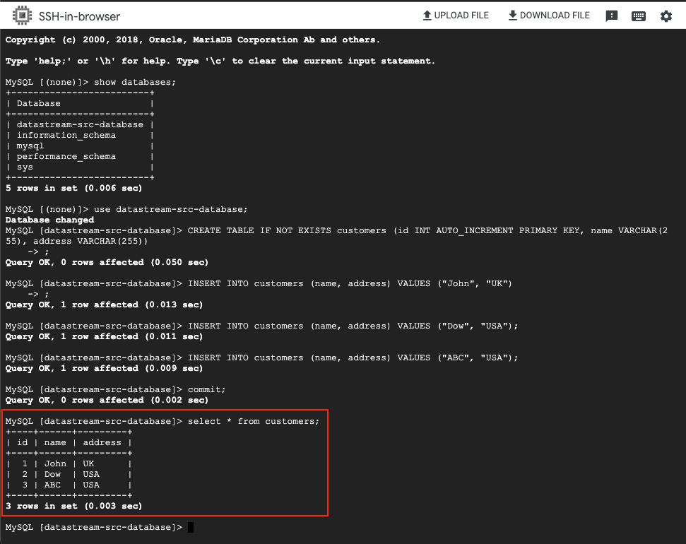

## Step 11: (TESTING) Checking Data in Destination BigQuery

After successfully adding data to the source database, the next step is to confirm that this data is replicated to our destination BigQuery dataset. Ideally, this replication should occur almost instantaneously, allowing us to observe the data transfer in near-real time.

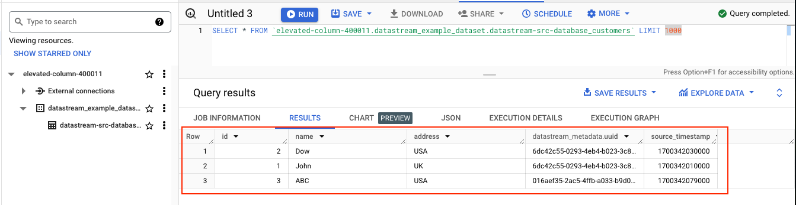
