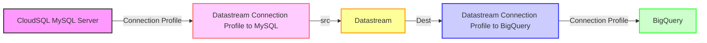

# Establishing a Datastream from Cloud SQL (MySQL) to BigQuery

This guide provides detailed instructions on setting up a datastream connection from Cloud SQL (MySQL) to BigQuery. We aim to simplify the process by using default settings and configurations wherever possible. The focus of this guide is on using the default settings for a specific region, with more complex custom configurations to be addressed in a future guide.

Here is an overview of what we are doing in the workflow. Complete terraform is on [GitHub](https://github.com/ahmedzbyr/taealam/tree/master/terraform_examples/datastream_to_cloud_sql_mysql)



- [Establishing a Datastream from Cloud SQL (MySQL) to BigQuery](#establishing-a-datastream-from-cloud-sql-mysql-to-bigquery)
  - [Prerequisites](#prerequisites)
  - [Step 1: Preparing Cloud SQL](#step-1-preparing-cloud-sql)
    - [Setting up a CloudSQL MySQL Server Using Terraform](#setting-up-a-cloudsql-mysql-server-using-terraform)
  - [Step 2: Creating a Destination `BigQuery` dataset](#step-2-creating-a-destination-bigquery-dataset)
  - [Step 3: Creating a Datastream Connection Profile to `MySQL` server](#step-3-creating-a-datastream-connection-profile-to-mysql-server)
  - [Step 4: Creating a Datastream Connection Profile to `BigQuery`](#step-4-creating-a-datastream-connection-profile-to-bigquery)
  - [Step 5: Creating a Datastream Stream From  `MySQL` to `BigQuery`](#step-5-creating-a-datastream-stream-from--mysql-to-bigquery)
  - [Loading Data on MySQL](#loading-data-on-mysql)


## Prerequisites

To proceed, you'll need:

1. Cloud SQL Instance
2. Datastream
3. BigQuery Dataset

**NOTE:** For simplicity, this guide initially uses a public IP setup for the MySQL server, although this is generally not recommended. Future guides will cover setting up a private connection using the Cloud SQL proxy node.

## Step 1: Preparing Cloud SQL

First, gather IP information for Datastream, which will connect to the Cloud SQL MySQL server. You can retrieve this information via the Datastream data source `google_datastream_static_ips` in Terraform:

```hcl
data "google_datastream_static_ips" "datastream_ips" {
  location = var.region
  project  = var.project
}
```

This Terraform script outputs a list of IPs in the specified region (e.g., `us-east1`). Each region will have different IPs that need authorization based on your requirements.

The output looks like this:

```shell
Changes to Outputs:

+ google_datastream_static_ips = [
  + "35.xxx.xxx.20",
  + "34.xxx.xxx.163",
  + ...
    ]
```

With these IPs, you can authorize connections to Datastream. Next, create a CloudSQL instance in the default (global) network with public IP address, which facilitates setting up the Datastream connection.

### Setting up a CloudSQL MySQL Server Using Terraform

Define necessary variables:

```hcl
# Region variable
# Specifies the geographic region where the resources will be deployed.
# Type: string
variable "region" {
  description = "The geographic region for deploying resources."
  type        = string
  default     = "us-east1"
}

# Project variable
# Identifies the Google Cloud project to which resources belong.
# Type: string
variable "project" {
  description = "The Google Cloud project ID."
  type        = string
  default     = "my-project-id"
}

# User variable
# Represents a username used in resource configurations, such as database users.
# Type: string
variable "user" {
  description = "The username used for configuring resources."
  type        = string
  default     = "datastream"
}
```

Retrieve all static IPs for Datastream, which are later authorized in CloudSQL:

```hcl
# Data block to retrieve static IPs for Datastream in a specified region and project
data "google_datastream_static_ips" "datastream_ips" {
  location = var.region  # The region where your resources are located
  project  = var.project # The Google Cloud project ID
}
```

Generate a random password string for the user/root. This should ideally be stored and retrieved securely, such as from a Vault:

```hcl
# Resource block for generating a random string
resource "random_string" "random" {
  length  = 16   # Specifies the length of the string. Here, it is set to 16 characters.
  special = true # When set to true, the string will include special characters.
  # If false, it will be alphanumeric only.
}

# Output block to output the generated random string
# This needs to be in the VAULT
output "password" {
  value = random_string.random.result # Outputs the result of the random string generation.
}

```

Create the CloudSQL server, setting `authorized_networks` based on the `google_datastream_static_ips` output: Please check `ip_configuration` in the below terraform. 

```hcl
# Resource to create a Cloud SQL database instance
resource "google_sql_database_instance" "main" {
  name             = "main-instance"             # Name of the SQL database instance
  database_version = "MYSQL_8_0"                 # Version of MySQL to use
  root_password    = random_string.random.result # Root password, randomly generated
  region           = var.region                  # Region for the database instance
  project          = var.project                 # Project ID

  settings {
    tier = "db-f1-micro" # The machine type (tier) for the database

    # Configuration for IP connectivity
    ip_configuration {
      # Dynamic block to authorize networks based on the IPs from Datastream
      dynamic "authorized_networks" {
        for_each = data.google_datastream_static_ips.datastream_ips.static_ips
        iterator = ips
        content {
          value = ips.value # Authorizing each IP for access
        }
      }
    }
    # Configuration for backups
    backup_configuration {
      enabled                        = true    # Enables backups
      binary_log_enabled             = true    # Enables binary logging for point-in-time recovery
      start_time                     = "20:55" # Start time for backup window
      transaction_log_retention_days = "7"     # Number of days to retain transaction logs
    }
  }
  deletion_protection = "false" # Disables deletion protection, use with caution
}
```

NOTE: We need to make sure the `binary_log_enabled` is enabled for MySQL Instance, check `backup_configuration` in the above terraform.


Establish a `datastream` user and database, allowing connection from any IP in the datastream:


```hcl

# Resource to create a SQL user
resource "google_sql_user" "users" {
  project  = var.project                            # Project ID
  name     = var.user                               # Name of the SQL user
  instance = google_sql_database_instance.main.name # Associate user with the SQL instance
  host     = "%"                                    # Allow connection from any host
  password = random_string.random.result            # Password for the SQL user, randomly generated
}

# Resource to create a SQL database within the instance
resource "google_sql_database" "datastream_src_database" {
  project         = var.project                            # Project ID
  name            = "datastream-src-database"              # Name of the database
  instance        = google_sql_database_instance.main.name # Database instance name
  deletion_policy = "ABANDON"                              # Deletion policy for the database
}
```


Alternatively, you could set up the user and permissions using SQL commands, but using Terraform is recommended:

```sql
CREATE USER 'datastream'@'%' IDENTIFIED BY '[YOUR_PASSWORD]';
GRANT REPLICATION SLAVE, SELECT, REPLICATION CLIENT ON *.* TO 'datastream'@'%';
FLUSH PRIVILEGES;
```

## Step 2: Creating a Destination `BigQuery` dataset

We will also need a destination to retrieve the data to, this will be a dataset. As we will be using `single_target_dataset` on the datastream, more about this can be found on the [datastream modules](https://github.com/ahmedzbyr/taealam/tree/master/tf_modules/datastream/datastream_stream) documentation.

```hcl
# Resource definition for creating a Google BigQuery dataset
resource "google_bigquery_dataset" "dataset" {
  project       = var.project                  # The Google Cloud project ID
  dataset_id    = "datastream_example_dataset" # Unique ID for the BigQuery dataset
  friendly_name = "datastream_example_dataset" # A user-friendly name for the dataset
  description   = "This is a test description" # Description of the dataset's purpose or contents
  location      = "us-east1"                   # The geographic location where the dataset should reside

  # Default expiration time for tables within this dataset (milliseconds)
  default_table_expiration_ms = 3600000 # 1 hour (3600000 milliseconds)

  # Labels for the dataset, useful for categorization or organization within GCP
  labels = {
    type = "datastream" # Example label indicating the dataset's intended for datastream
  }

  # If set to true, this ensures that all contents within the dataset will be deleted upon the dataset's destruction
  delete_contents_on_destroy = true # Use with caution to prevent accidental data loss
}
```


## Step 3: Creating a Datastream Connection Profile to `MySQL` server

After preparing the MySQL server, the next step is to establish a connection using the user credentials created earlier.

Use a resource to wait for user creation, then set up the connection profile:

```hcl
# Wait for user creation before setting up a connection profile.
resource "time_sleep" "main" {
  create_duration = "30s"
  depends_on      = [google_sql_user.users]
}
```

Create the connection profile, incorporating the username and password set up in the MySQL server:

```hcl
module "connection_profile_id" {
  source                = "git::https://github.com/ahmedzbyr/taealam.git//tf_modules/datastream/datastream_connection_profile"
  project               = var.project         # Project where the connection profile will be created
  display_name          = "ahmd-connec-mysql" # Display name for the connection profile
  location              = var.region          # Location of the connection profile
  connection_profile_id = "ahmd-connec-mysql" # Unique identifier for the connection profile
  labels = {
    key = "value"
  }
  mysql_profile = {
    hostname = google_sql_database_instance.main.ip_address.0.ip_address # (Required) Hostname for the MySQL connection.
    port     = "3306"                                                    # (Optional) Port for the MySQL connection, default value is 3306.
    username = var.user                                                  # (Required) Username for the MySQL connection.
  }
  #
  # IMPORTANT NOTE:
  #   This secret has to be from a VAULT and should not be in plain text as it is here 
  #   Adding it here for testing only. 
  #
  secret = {
    mysql_profile = {
      password = random_string.random.result # Password for MySQL profile (Required if using mysql_profile)
    }
  }

  depends_on = [time_sleep.main]
} 
```


With these steps completed, at this point we have the Source database is ready, connection profile to it from datastream is ready.


## Step 4: Creating a Datastream Connection Profile to `BigQuery`

In the bigQuery connection make sure you have the correct location based on the requirement. We are using `us-east1` across all resources on the workflow.

| Field    | Description                                                                                                                                                                                                                                                                                                                                                                                                                                        |
| :-------- | :-------------------------------------------------------------------------------------------------------------------------------------------------------------------------------------------------------------------------------------------------------------------------------------------------------------------------------------------------------------------------------------------------------------------------------------------------- |
| Location | Select the region where the connection profile is stored. Connection profiles, like all resources, are saved in a region, and a stream must use connection profiles stored in the same region as the stream. The region selection doesn't impact Datastream's ability to connect but may affect availability during region downtime. Region selection is also independent of the location type you selected for your BigQuery destination dataset. |

```hcl
module "create_connection_profile_bq" {
  source                = "git::https://github.com/ahmedzbyr/taealam.git//tf_modules/datastream/datastream_connection_profile"
  project               = "my-project-id"  # Project where the connection profile will be created
  display_name          = "ahmd-connec-bq" # Display name for the connection profile
  location              = "us-east1"       # Location of the connection profile
  connection_profile_id = "ahmd-connec-bq" # Unique identifier for the connection profile

  labels = {
    key = "value"
  }
  bigquery_profile = {}
}
```


**NOTE:** There are no configuration on the bigquery side, its just a `{}` to enable the bigquery connection. 


## Step 5: Creating a Datastream Stream From  `MySQL` to `BigQuery`

In our Terraform configuration, we establish the stream by utilizing the `src` (source) and `dest` (destination) connections that were previously set up. 

For an in-depth understanding of the configuration parameters, you can refer to the [datastream module](https://github.com/ahmedzbyr/taealam/tree/master/tf_modules/datastream). Additionally, for further examples and practical applications, visit our [GitHub repository](https://github.com/ahmedzbyr/taealam/tree/master/tf_modules/datastream/examples).


```hcl
module "datastream_mysql_to_bq_dataset" {
  source  = "git::https://github.com/ahmedzbyr/taealam.git//tf_modules/datastream/datastream_stream"
  project = var.project # Project where the connection profile will be created

  # Set a human-readable name for the Datastream stream
  display_name = "ahmed-ds-stream"

  # Unique identifier for the Datastream stream
  stream_id = "ahmed-ds-stream"

  # The location where the Datastream resource will be created
  location = var.region

  # Labels are key/value pairs for tagging and organizing GCP resources
  labels = {
    type = "datastream"
  }

  # Backfill configuration to determine how historical data is handled
  backfill_all = {}

  # Desired state of the Datastream stream, e.g., "RUNNING" or "PAUSED"
  desired_state = "RUNNING"

  # Configuration for the source connection profile
  source_connection_profile = module.create_src_connection_profile_mysql.this_connection_profile_id # "projects/{project}/locations/{location}/connectionProfiles/{name}"
  mysql_source_config = {
    include_objects = {
      mysql_databases = [{
        database = google_sql_database.datastream_src_database.name
      }]
    }
  } # Placeholder for MySQL source-specific configuration

  # Configuration for the destination connection profile
  destination_connection_profile = module.create_dest_connection_profile_bq.this_connection_profile_id # "projects/{project}/locations/{location}/connectionProfiles/{name}"
  bigquery_destination_config = {
    # Configuration for BigQuery as the destination
    single_target_dataset = {
      # ID of the BigQuery dataset to which the Datastream will write data
      dataset_id = google_bigquery_dataset.dataset.id
    }
  }
}
```


## Loading Data on MySQL

We can now load some data into the database at the source using a simple python code as below. To populate the source database with data, we can use the following straightforward Python script to make is easy for us. This script connects to the MySQL database, creates a new table (if it doesn't already exist), and inserts multiple records into it.


```python
import mysql.connector

# Connect to the MySQL database
mydb = mysql.connector.connect(
    host="database_ip_address",
    user="datastream",
    password="password_to_connect",
    database="datastream-src-database"
)

mycursor = mydb.cursor()

# Create a new table 'customers' if it doesn't exist
mycursor.execute("CREATE TABLE IF NOT EXISTS customers (id INT AUTO_INCREMENT PRIMARY KEY, name VARCHAR(255), address VARCHAR(255))")

# SQL query for inserting data
sql = "INSERT INTO customers (name, address) VALUES (%s, %s)"

# Data to be inserted
vals = [
    ("John", "Highway 21"),
    ("Jane", "Lowstreet 4"),
    ("Mary", "Apple st 652"),
    ("Peter", "Mountain 21"),
    ("Sandy", "Ocean blvd 2")
]

# Insert multiple records into the 'customers' table
mycursor.executemany(sql, vals)

# Commit the transaction
mydb.commit()

print(mycursor.rowcount, "records inserted.")  # Print the number of records inserted
```

After running this script, the inserted data will be replicated in the BigQuery destination. 

**Note:** When using the `single_target_dataset` configuration, tables within the dataset will follow the `databaseName_tableName` naming convention.


This marks the completion of our guide on establishing a Datastream connection from MySQL to BigQuery. The same principles can be applied to migrating data from PostgreSQL, with a few minor adjustments - the core process remains consistent.

It's important to note that in this setup, we've utilized the default settings, which simplified our configuration as it required fewer firewall rules, only necessitating the specification of authorized networks for CloudSQL. However, this scenario might not align with typical organizational setups. In a more standard enterprise environment, CloudSQL is often isolated within a shared VPC and accessed exclusively through a cloud authentication proxy node.

In future blog posts, we plan to delve into creating a VPC and setting up an environment that more closely mirrors a typical corporate network infrastructure. For the time being, consider this post as an introductory guide to get started with Datastream.
